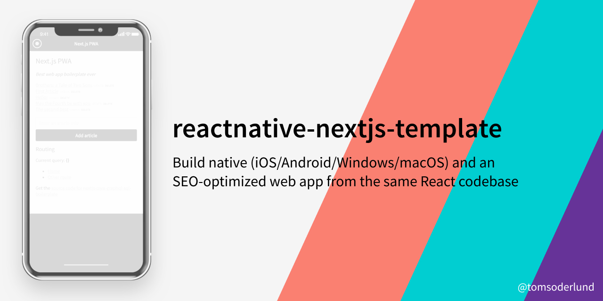
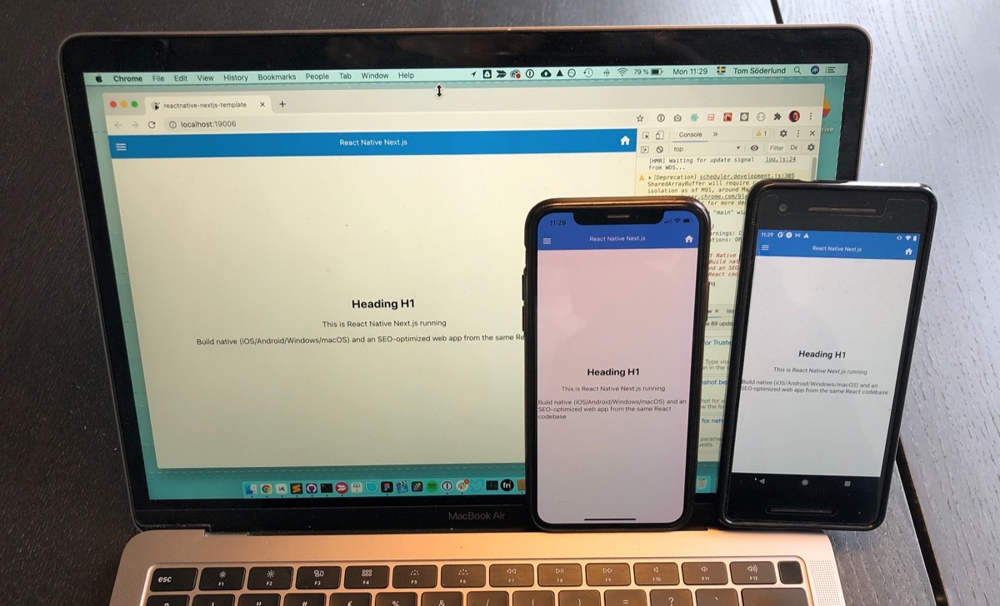

# reactnative-nextjs-template

> NOTE: Work in progress until version is 1.0.0+

**Build native apps (iOS/Android/Windows/macOS) and an SEO-optimized web app from the same React codebase, using React Native/Expo and Next.js**

(Created with `npx create-next-app -e with-expo [PROJECTNAME]`)

_Note: this is my v5 boilerplate for React apps. See also my [Next.js + Firebase boilerplate](https://github.com/tomsoderlund/nextjs-pwa-firebase-boilerplate)._

## Support this project

Did you or your company find `reactnative-nextjs-template` useful? Please consider giving a small donation, it helps me spend more time on open-source projects:

## Why is this awesome?

This allows you to build _both_ a native app for [iOS/Android/Windows/macOS/etc](https://reactnative.dev/docs/out-of-tree-platforms), as well as an SEO-optimized web app _from same codebase_.

- [X] Server-side rendering (SSR)
- [X] SEO: Semantic tags e.g. H1, H2, H3
- [X] SEO: Page metadata support
- [X] Header (from `react-native-elements`)
- [ ] Navigation
- [ ] Flexible CSS solution
- [ ] Font support
- [ ] SVG support
- [X] Video player

## Demo

See [**reactnative-nextjs-template** running on Vercel here](https://reactnative-nextjs-template.vercel.app/).

## Deploying

Setup and deploy your own project using this template with [Vercel](https://vercel.com):

## How to use

> Note: If you set up your project using the Deploy button above, you only need to clone your own repo instead of this repository.

Clone this repository:

    git clone https://github.com/tomsoderlund/reactnative-nextjs-template.git [MY_APP]

Remove the .git folder since you want to create a new repository

    rm -rf .git

Install dependencies:

    cd [MY_APP]
    yarn  # or npm install

Start it by doing the following:

    yarn dev

…then navigate to `http://localhost:3005/`

Start Expo for native apps:

	expo start

In production:

    yarn build
    yarn start

## Modifying the app to your needs

### Change app name

Do search/replace for “reactnative-nextjs-template” to something else.

Change name in `public/manifest.json`

### Change port number

Do search/replace for “3005” to something else.
